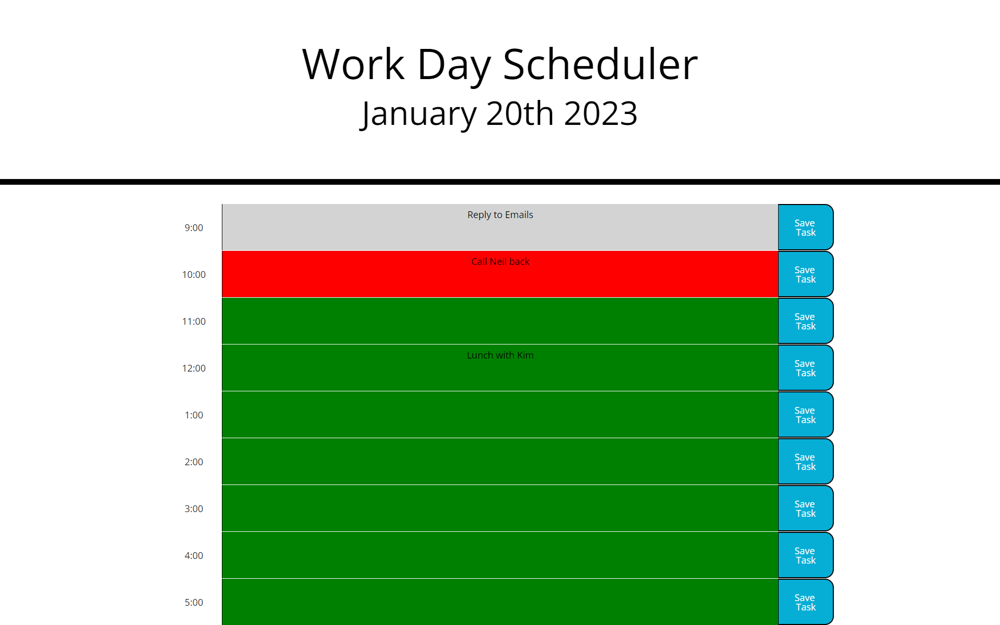

# Work-Day-Scheduler-Luana

## Description

Work Day Scheduler allows users to keep track of their tasks for the day with an hourly schedule that can be added to or removed and remain saved throught the day as well as hekp keep track of time with color changing hourly time blocks.

## Installation

To deploy the Work Day Scheduler [CLICK HERE](https://luanaparedes.github.io/Work-Day-Scheduler-Luana/)

## Usage

Users can stay organized and ready for what the day has planned with the hourly color changing time slots that can add or remove tasks entered by user. 

## Credits

https://www.w3schools.com/jsref/jsref_split.asp 
https://www.geeksforgeeks.org/for-each-loop-in-java/
https://stackoverflow.com/questions/2398099/jquery-equivalent-of-javascripts-addeventlistener-method
https://developer.mozilla.org/en-US/docs/Web/API/Window/storage_event